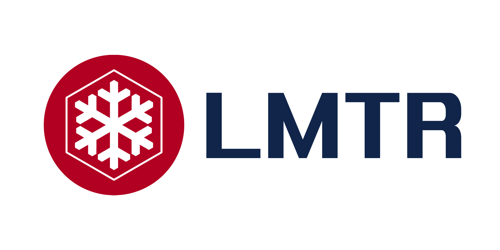

# 简介
## LMTR
LMTR，Liteyuki Minecraft Transit Railway，轻雪铁路，亦可简称轻铁，服务于Liteyuki Minecraft Server的官方铁路系统。目标是为Liteyuki Minecraft Server的玩家提供一个便捷、快速、安全的交通方式，使玩家能够更好地探索Liteyuki Minecraft Server的世界。

## 乘搭指南
LMTR使用「羽币」作为交易货币，乘客可在任意车站乘搭

## 线路图
### 中央线(Central Line)

### 花溪线(Fleur Line)

### 离岛线(Island Line)

